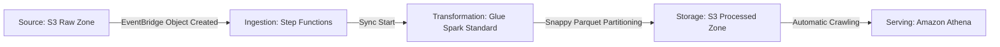

# Serverless E-Commerce Data Lake & ETL Pipeline

An enterprise-grade, event-driven serverless data lake and analytics pipeline built on AWS using Terraform. This project ingests, cleanses, and transforms raw e-commerce transaction data at scale using Apache Spark, automated state orchestration, and serverless querying.

## Architecture & Data Flow

Data flows chronologically from left to right through an entirely serverless, zero-idle-compute architecture:



1. **Source & Ingestion (S3 & EventBridge):** Raw CSV data lands in the S3 Raw Zone. Amazon EventBridge catches the `Object Created` event instantly, eliminating polling overhead and reducing operational costs.
2. **Orchestration (AWS Step Functions):** Manages the execution lifecycle by triggering the Spark job, starting the Glue Crawler, and running a resilient polling loop until cataloging completes.
3. **Transformation (Amazon Glue & PySpark):** Processes records using distributed compute, applies data cleansing (filtering negative quantities), and writes out optimized files.
4. **Serving (Amazon Athena):** Exposes structured, high-performance data for analytical querying via the Glue Data Catalog.

## Technology Stack & Architecture Justifications

* **Infrastructure as Code — Terraform (`~> 6.0`):** Chosen over AWS CloudFormation for its modular reusability, state management, and widespread industry adoption in production environments.
* **Compute Engine — Amazon Glue (Standard Execution Class, `G.1X` Workers):** Selected over Glue Flex execution to guarantee dedicated worker allocation and eliminate queue wait times during pipeline execution.
* **Storage Format — Apache Snappy Parquet:** Chosen over raw CSV/JSON formats for its columnar compression, splitability, and drastically reduced Athena scan costs.
* **Orchestration — AWS Step Functions:** Chosen over cron-based scheduling to achieve true event-driven reactivity and robust error retry logic.

## Business & Engineering Impact (Why This Matters)

For engineering leadership and data teams, this architecture delivers measurable ROI across three key vectors:
* **Cost Optimization & Zero Idle Spend:** By leveraging a fully serverless, event-driven model, compute resources scale to zero when idle. There are no provisioned clusters running up continuous bills. Furthermore, Snappy Parquet compression drastically reduces S3 storage footprints and lowers Amazon Athena query scan costs.
* **Operational Resilience & Automation:** Automated orchestration via Step Functions with built-in retry logic and crawler state polling eliminates manual intervention and prevents broken downstream dashboards caused by uncataloged data drops.
* **Enterprise Security & Governance:** Built from the ground up using least-privilege IAM principles, ensuring a minimized blast radius and compliance-ready data access boundaries.

## Project Structure

```text
ecommerce-serverless-pipeline/
├── infrastructure/             # Modularized Terraform configuration
│   ├── main.tf                 # Core providers, S3 buckets, EventBridge, Athena workgroup
│   ├── glue.tf                 # Glue database, crawler, job definition, and IAM roles
│   ├── iam.tf                  # Step Functions & EventBridge least-privilege IAM policies
│   └── outputs.tf              # Resource ARNs and bucket IDs
├── src/                        # Application source code
│   └── glue_job.py             # PySpark transformation and dynamic partitioning script
├── .gitignore                  # Excludes local state files, credentials, and temp outputs
└── README.md                   # Project documentation
```

## Key Engineering Highlights

* **Event-Driven Architecture:** Zero idle compute; pipelines trigger instantaneously upon file arrival.
* **Dynamic Partitioning:** Employs Spark `partitionOverwriteMode = dynamic` to safely manage ingestion-date partitioning (`ingestion_date=YYYY-MM-DD`) without redundant full-table overwrites.
* **Least-Privilege Security:** Granular IAM execution roles restricting permissions strictly to required resource ARNs.

## Deployment Instructions

1. **Clone the Repository:**
   ```bash
   git clone [https://github.com/YOUR_USERNAME/ecommerce-serverless-pipeline.git](https://github.com/YOUR_USERNAME/ecommerce-serverless-pipeline.git)
   cd ecommerce-serverless-pipeline/infrastructure
   ```

2. **Initialize & Apply Infrastructure:**
   ```bash
   terraform init
   terraform plan
   terraform apply
   ```