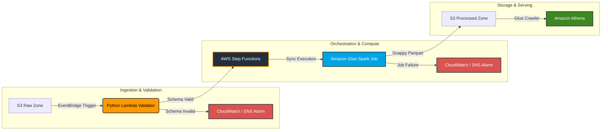

# Serverless E-Commerce Data Lake & ETL Pipeline

An enterprise-grade, event-driven serverless data lake and analytics pipeline built on AWS using Terraform. This project ingests, validates, cleanses, and transforms raw e-commerce transaction data at scale using Amazon Lambda, Apache Spark, automated state orchestration, and serverless querying.

## Architecture & Data Flow

Data flows chronologically from left to right through an entirely serverless, zero-idle-compute architecture with strict pre-flight validation gates:



1. **Source & Pre-Flight Gatekeeper (S3, EventBridge, & Lambda):** Raw CSV data lands in the S3 Raw Zone. Amazon EventBridge catches the Object Created event instantly and routes it to an AWS Lambda validator. Lambda reads the file headers using a lightweight byte range fetch, performing case-insensitive validation for required columns (`quantity` and `customerid`). Corrupt files are blocked instantly before spawning costly compute clusters.
2. **Orchestration (AWS Step Functions):** Triggered conditionally only upon successful validation, managing the execution lifecycle by kicking off the Spark job, starting the Glue Crawler, and running a resilient polling loop until cataloging completes.
3. **Transformation (Amazon Glue & PySpark):** Processes records using distributed compute, applies data cleansing (filtering negative quantities), and writes out optimized files.
4. **Serving (Amazon Athena):** Exposes structured, high-performance data for analytical querying via the Glue Data Catalog.

## Technology Stack & Architecture Justifications

* **Infrastructure as Code — Terraform (~> 6.0):** Chosen over AWS CloudFormation for its modular reusability, state management, and widespread industry adoption in production environments.
* **Pre-Flight Validation — AWS Lambda (Python 3.11):** Implemented to intercept malformed data at the edge, eliminating downstream compute waste and enforcing strict data contract enforcement.
* **Compute Engine — Amazon Glue (Standard Execution Class, G.1X Workers):** Selected over Glue Flex execution to guarantee dedicated worker allocation and eliminate queue wait times during pipeline execution.
* **Storage Format — Apache Snappy Parquet:** Chosen over raw CSV/JSON formats for its columnar compression, splitability, and drastically reduced Athena scan costs.
* **Orchestration — AWS Step Functions:** Chosen over cron-based scheduling to achieve true event-driven reactivity and robust error retry logic.
* **Observability & Alerting — Amazon CloudWatch & SNS:** Configured with closed-loop metric alarms (treat_missing_data = "notBreaching") to automatically reset state after incident resolution and page engineering teams instantly via email.

## Business & Engineering Impact (Why This Matters)

For engineering leadership and data teams, this architecture delivers measurable ROI across three key vectors:
* **Cost Optimization & Zero Idle Spend:** By leveraging a fully serverless, event-driven model with a pre-flight validator, compute resources scale to zero when idle, and garbage data never triggers expensive Spark workloads. Furthermore, Snappy Parquet compression drastically reduces S3 storage footprints and lowers Amazon Athena query scan costs.
* **Operational Resilience & Automation:** Automated orchestration via Step Functions with built-in retry logic and crawler state polling eliminates manual intervention. Paired with closed-loop SNS alerting, system failures and data contract violations are flagged instantly.
* **Enterprise Security & Governance:** Built from the ground up using least-privilege IAM principles, ensuring a minimized blast radius and compliance-ready data access boundaries across Lambda, S3, and Step Functions.

## Project Structure
```
ecommerce-serverless-pipeline/
├── infrastructure/             # Modularized Terraform configuration
│   ├── main.tf                 # Core providers, S3 buckets, EventBridge, Athena workgroup
│   ├── glue.tf                 # Glue database, crawler, job definition, and IAM roles
│   ├── lambda.tf               # Lambda schema validator function and least-privilege IAM
│   ├── iam.tf                  # Step Functions orchestrator and execution IAM roles
│   ├── monitoring.tf           # SNS topics, email subscriptions, and CloudWatch auto-reset alarms
│   ├── outputs.tf              # Resource ARNs and bucket IDs
│   └── variables.tf            # Global variables (AWS region, etc.)
├── src/                        # Application source code
│   ├── validator_lambda.py     # Pre-flight schema validation logic
│   └── glue_job.py             # PySpark transformation and dynamic partitioning script
├── .gitignore                  # Excludes local state files, credentials, and temp outputs
└── README.md                   # Project documentation
```

## Key Engineering Highlights

* **Event-Driven Architecture:** Zero idle compute; pipelines trigger instantaneously upon file arrival with automated schema validation gates.
* **Dynamic Partitioning:** Employs Spark partitionOverwriteMode = dynamic to safely manage ingestion-date partitioning (ingestion_date=YYYY-MM-DD) without redundant full-table overwrites.
* **Least-Privilege Security:** Granular IAM execution roles restricting permissions strictly to required resource ARNs.
* **Closed-Loop Observability:** Dual-layer monitoring tracking both Step Functions workflow failures and Lambda validation rejections, routing instant updates through SNS with automated alarm state resets.

## Deployment Instructions

1. **Clone the Repository:**
```
   git clone https://github.com/YOUR_USERNAME/ecommerce-serverless-pipeline.git
   cd ecommerce-serverless-pipeline/infrastructure
```
3. **Initialize & Apply Infrastructure:**
```
   terraform init
   terraform plan
   terraform apply
```
